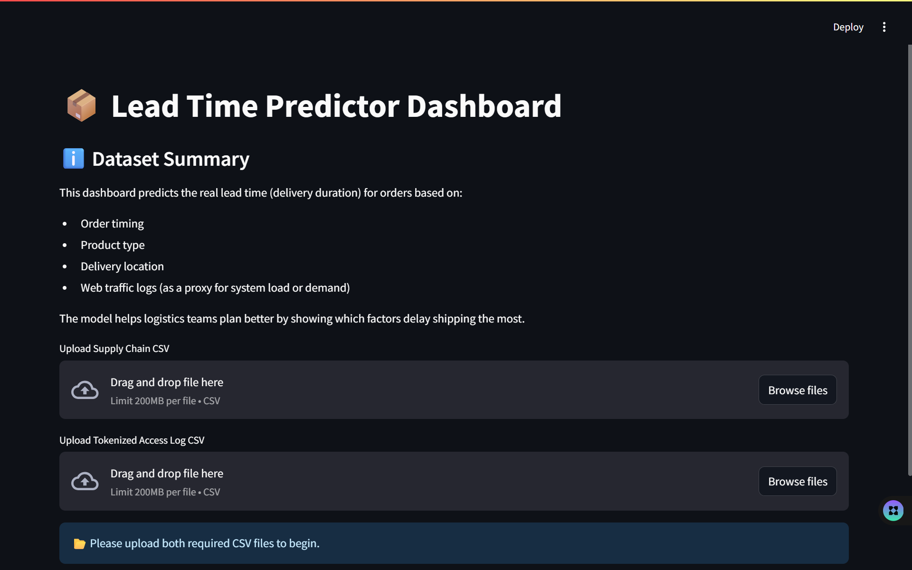
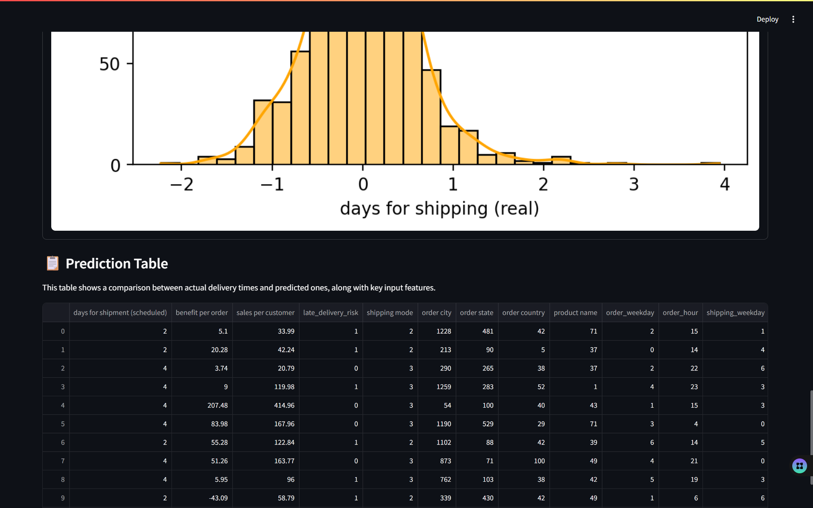

# 🚚 Lead Time Prediction Model with Streamlit Dashboard

This project predicts real lead time (actual delivery duration) for customer orders using a trained machine learning model. It integrates features like product traffic logs, order metadata, and time-based features to help logistics professionals optimize delivery performance.



---

## 📁 Project Structure
```
├── LTP2.py # Core model training and evaluation script (CLI)
├── lead_time_dashboard.py # Streamlit dashboard for interactive use
├── DataCoSupplyChainDataset.csv # Main supply chain dataset
├── tokenized_access_logs.csv # Product-hour traffic logs
├── predictions.csv # Output predictions from LTP2.py
└── feature_importance_with_traffic.png # Feature importance visualization
```

---

## 📦 Installation

Ensure Python 3.8+ is installed. It is recommended to use a virtual environment.

### 🛠 Create and activate virtual environment

```bash
# Create a virtual environment
python -m venv .venv

# Activate it (Windows)
.venv\Scripts\activate

# OR (Mac/Linux)
source .venv/bin/activate

#Install Libraries 
pip install pandas numpy matplotlib seaborn scikit-learn xgboost lightgbm streamlit


#Run the model training and evaluation in your terminal:
python LTP2.py

(🔍 This script will:
Load the first 5000 rows from the supply chain dataset

Merge product traffic logs from tokenized_access_logs.csv

Extract features like weekday, hour, location, and traffic

Train a RandomForestRegressor with grid search

Print:

MAE (Mean Absolute Error)

R² Score

Output:

predictions.csv: Actual vs Predicted lead time

feature_importance_with_traffic.png: Key influencing features)

#To launch the interactive dashboard, run:
streamlit run lead_time_dashboard.py

(What you can do in the dashboard:
Upload required files:

DataCoSupplyChainDataset.csv

tokenized_access_logs.csv

Select one of the following models:

Random Forest

XGBoost

LightGBM

Visualizations provided:

📉 MAE & R² Score

📊 Feature Importance (Top predictors)

🟠 Residual Distribution

📋 Prediction Table (actual vs predicted)

⬇️ Download predictions as CSV)

#Required CSV Files
| File Name                      | Description                                        |
| ------------------------------ | -------------------------------------------------- |
| `DataCoSupplyChainDataset.csv` | Supply chain data with shipping/order/product info |
| `tokenized_access_logs.csv`    | Product-hour web traffic logs used for enrichment  |


#Developed and maintained by [TUSHAR NAYAK]
Feel free to fork, improve, and contribute!